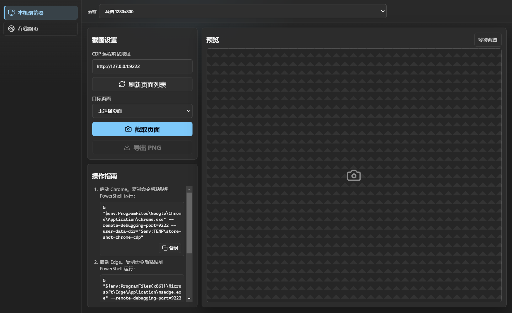

# Web Extension Store Screenshot Tool

**Languages:** English | [简体中文](README.zh-CN.md)

A desktop screenshot and PNG export tool for Web extension developers, designed to generate listing assets for Chrome Web Store, Microsoft Edge Add-ons, Firefox AMO, Opera Add-ons, and similar extension stores.



## Download

The Windows portable EXE is published on GitHub Releases:

- [View the latest Release](https://github.com/Un1quer23/web-extension-store-screenshot-tool/releases/latest)

The portable build does not bundle Playwright Chromium. Captures prefer the local Chrome installation first, then Microsoft Edge.

## Features

- Local browser: connect to a manually started Chrome or Edge instance over CDP and capture an already-opened page in its prepared state.
- Online page: enter a URL and let the tool open the page with the local Chrome or Edge runtime before capturing it.
- Asset sizes: use built-in extension store asset sizes or enter a custom width and height.
- Page position: in online page mode, capture the top, middle, bottom, or a custom scroll position.
- PNG export: preview the capture and export a PNG that matches the selected size.

## Usage

1. Choose a capture source on the left: `Local browser` or `Online page`.
2. Choose an asset size at the top; select `Custom size` when you need a free-form width and height.
3. Configure the current capture source and run the capture.
4. Preview the result and compliance notes on the right.
5. Click `Export PNG` and choose the output location.

## Local Browser Mode

Local browser mode is useful when you need to capture a page that is already open and manually prepared. Start Chrome or Edge with a remote debugging port, then return to the app and refresh the page list.

Chrome:

```powershell
& "$env:ProgramFiles\Google\Chrome\Application\chrome.exe" --remote-debugging-port=9222 --user-data-dir="$env:TEMP\store-shot-chrome-cdp"
```

Edge:

```powershell
& "${env:ProgramFiles(x86)}\Microsoft\Edge\Application\msedge.exe" --remote-debugging-port=9222 --user-data-dir="$env:TEMP\store-shot-edge-cdp"
```

If Chrome is installed in the 32-bit Program Files directory:

```powershell
& "${env:ProgramFiles(x86)}\Google\Chrome\Application\chrome.exe" --remote-debugging-port=9222 --user-data-dir="$env:TEMP\store-shot-chrome-cdp"
```

After starting the browser, open the target page in that browser window. In the app, keep the CDP endpoint as `http://127.0.0.1:9222`, click `Refresh pages`, choose the target page, and capture it.

## Custom Sizes

Custom sizes require integer width and height values in the `100-7680` range, with a maximum pixel area of `7680x4320`.

Custom size capture is a free-form export option. It does not guarantee that the output satisfies the submission requirements for Chrome Web Store, Microsoft Edge Add-ons, Firefox AMO, or Opera Add-ons.

## Development

```bash
npm install
npm run dev
npm run build
npm test
```

## Packaging

```bash
npm run dist:portable
```

Build artifacts are written to `dist/`.

## Security

See [SECURITY.md](SECURITY.md) for security reporting guidance. If a report is not suitable for public discussion, contact the maintainer privately through GitHub first.

## License

This project is open source software licensed under GNU General Public License v3.0 only. See [LICENSE](LICENSE).
